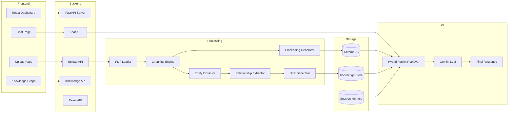
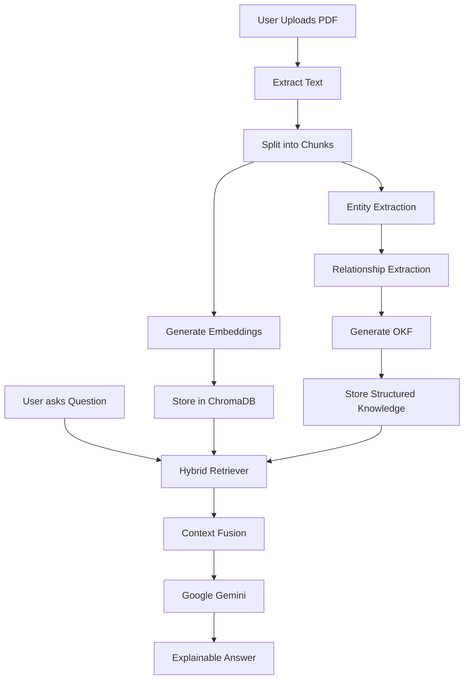
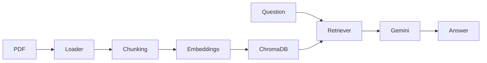
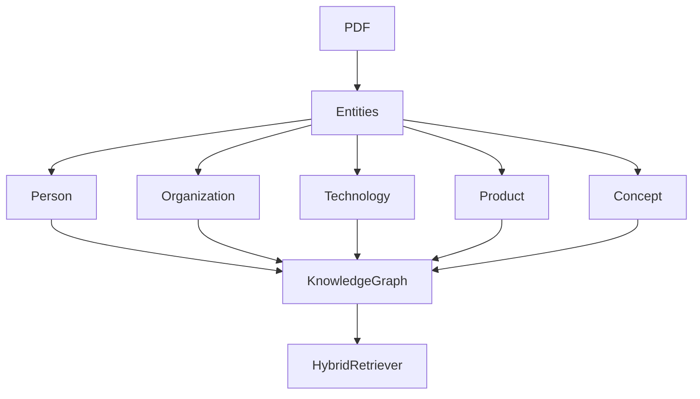
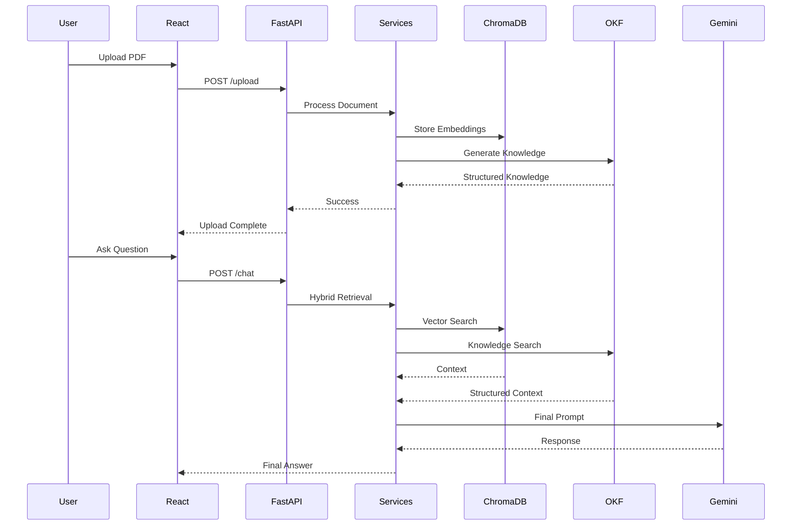

<div align="center">

# 🚀 Hybrid RAG Engine

### Enterprise Knowledge Retrieval using **Hybrid RAG + Open Knowledge Format (OKF)**


<br>


<br><br>

> **A next-generation Retrieval-Augmented Generation (RAG) platform that combines Semantic Search, Structured Knowledge Extraction, Knowledge Graphs, and Hybrid Retrieval to deliver highly accurate, explainable, and context-aware answers from enterprise documents.**

</div>

---

# 📚 Table of Contents

- [Overview](#-overview)
- [Problem Statement](#-problem-statement)
- [Solution](#-solution)
- [Why Hybrid RAG + OKF?](#-why-hybrid-rag--okf)
- [Feature Comparison](#-feature-comparison)
- [Key Features](#-key-features)
- [Project Highlights](#-project-highlights)

---

# 📖 Overview

Traditional document search systems struggle with large volumes of unstructured information.

Although Retrieval-Augmented Generation (RAG) significantly improves Large Language Model (LLM) responses by retrieving relevant document chunks, traditional RAG systems still have several limitations:

- Retrieval depends only on vector similarity.
- Relationships between entities are ignored.
- Multi-hop reasoning is weak.
- Retrieved context is difficult to explain.
- Hallucinations may still occur when semantic retrieval misses important connections.

This project introduces a **Hybrid Retrieval Architecture** by integrating **Open Knowledge Format (OKF)** with traditional RAG.

Instead of relying solely on vector embeddings, the system also builds a structured representation of document knowledge through entities, relationships, and knowledge graphs.

The final response is generated after combining:

- Semantic Context
- Structured Knowledge
- Relationship Graph
- User Query
- Conversational Context

This architecture enables significantly more reliable and explainable document question answering.

---

# 🎯 Problem Statement

Enterprise organizations generate thousands of documents every day, including:

- Technical Documentation
- Research Papers
- Standard Operating Procedures
- HR Policies
- Financial Reports
- Contracts
- User Manuals
- Compliance Documents

Finding the correct information manually is time-consuming.

Even traditional RAG systems often retrieve only semantically similar chunks without understanding:

- relationships between concepts,
- entity dependencies,
- document hierarchy,
- cross-page references.

This results in incomplete answers and reduced explainability.

---

# 💡 Solution

Hybrid RAG Engine introduces an additional knowledge layer called **Open Knowledge Format (OKF)**.

The system performs two retrieval processes simultaneously:

### 1️⃣ Semantic Retrieval

Uses embeddings stored inside **ChromaDB** to retrieve semantically relevant chunks.

---

### 2️⃣ Knowledge Retrieval

Extracts:

- Entities
- Relationships
- Metadata
- Knowledge Graph

and stores them as structured OKF objects.

---

Finally,

```
Vector Retrieval
          +
Knowledge Retrieval
          +
Context Fusion
          +
Gemini LLM
          =
Explainable Response
```

---

# 🚀 Why Hybrid RAG + OKF?

Unlike traditional RAG systems, this project combines **semantic intelligence** with **structured knowledge reasoning**.

This enables the model to answer questions using:

- semantic similarity,
- document relationships,
- entity hierarchy,
- graph traversal,
- structured metadata,
- conversational history.

The result is significantly higher retrieval quality and better explainability.

---

# 📊 Feature Comparison

| Capability | Traditional RAG | Hybrid RAG + OKF |
|------------|-----------------|------------------|
| Semantic Search | ✅ | ✅ |
| Vector Database | ✅ | ✅ |
| Entity Extraction | ❌ | ✅ |
| Relationship Extraction | ❌ | ✅ |
| Knowledge Graph | ❌ | ✅ |
| Structured Knowledge | ❌ | ✅ |
| Hybrid Retrieval | ❌ | ✅ |
| Explainable AI | ❌ | ✅ |
| Multi-hop Reasoning | Limited | Advanced |
| Context Fusion | ❌ | ✅ |
| Lower Hallucinations | ❌ | ✅ |
| Enterprise Ready | Partial | ✅ |

---

# ✨ Key Features

## 📄 Intelligent PDF Processing

- Multi-document upload
- Automatic document parsing
- Intelligent text extraction
- Metadata preservation

---

## ✂️ Advanced Chunking

- Configurable chunk size
- Chunk overlap support
- Context-aware splitting
- Optimized retrieval quality

---

## 🧠 AI-Powered Embeddings

- Google Gemini embeddings
- High-dimensional semantic vectors
- Efficient similarity search

---

## 📦 ChromaDB Vector Storage

- Fast semantic retrieval
- Persistent storage
- Optimized indexing
- Low-latency querying

---

## 🌐 Open Knowledge Format (OKF)

Automatically generates:

- Entities
- Relationships
- Attributes
- Document metadata
- Structured knowledge

---

## 🔗 Knowledge Graph

Creates graph representation of:

- People
- Organizations
- Technologies
- Products
- Concepts
- Dependencies

---

## 🔥 Hybrid Retrieval

Combines:

- Vector Search
- Knowledge Search
- Context Fusion
- Conversational Memory

before generating the final response.

---

## 💬 Conversational AI

Supports:

- Multi-turn conversations
- Context preservation
- Memory-aware responses
- Follow-up questions

---

## ⚡ REST API Architecture

Modular FastAPI backend with:

- Upload APIs
- Chat APIs
- Knowledge APIs
- Graph APIs
- Session APIs

---

## 🎨 Modern React Frontend

Interactive dashboard providing:

- PDF Upload
- Chat Interface
- Knowledge Graph Viewer
- Session Reset
- Responsive UI

---

# 🌟 Project Highlights

✅ Hybrid Retrieval Architecture

✅ Open Knowledge Format (OKF)

✅ Knowledge Graph Generation

✅ Explainable AI

✅ Enterprise Modular Architecture

✅ Production-ready REST APIs

✅ FastAPI Backend

✅ React Frontend

✅ Google Gemini Integration

✅ LangChain Framework

✅ ChromaDB Vector Database

✅ Multi-document Question Answering

✅ Extensible Service-Oriented Design

---

> 🚀 **Hybrid RAG Engine bridges the gap between semantic retrieval and structured knowledge reasoning, enabling enterprise-grade document intelligence with significantly improved accuracy, explainability, and contextual understanding.**
---

# 🏗️ System Architecture

The Hybrid RAG Engine follows a modular microservice-inspired architecture where each component is responsible for a single stage of the document intelligence pipeline.



---

# 🔄 End-to-End Workflow

The following workflow illustrates how the complete system processes a PDF and answers user questions.



---

# 🧠 Traditional RAG Pipeline

The semantic retrieval pipeline retrieves document chunks based on vector similarity.



---

# 📘 Open Knowledge Format (OKF) Pipeline

The OKF pipeline extracts structured knowledge from documents.

```mermaid
flowchart LR

PDF

-->

OCR / Loader

-->

Entity Extraction

-->

Relationship Extraction

-->

Metadata Extraction

-->

OKF Generator

-->

Knowledge Store

-->

Knowledge Graph

```

---

# 🔥 Hybrid Retrieval Pipeline

The Hybrid Retriever combines semantic retrieval and structured retrieval before sending context to Gemini.

```mermaid
flowchart LR

Question

-->

Vector Search

-->

Semantic Context

Semantic Context

-->

Fusion Engine

Question

-->

Knowledge Search

-->

Structured Context

Structured Context

-->

Fusion Engine

Fusion Engine

-->

Gemini

-->

Final Answer

```

---

# 🌐 Knowledge Graph Architecture

Relationships extracted from documents are represented as a graph.



---

# ⚙ Backend Request Flow

Every API request follows the following lifecycle.



---

# ⚙ Backend Service Layer

The backend is divided into independent service modules.

| Service | Responsibility |
|----------|----------------|
| **Loader Service** | Extract text from uploaded PDF |
| **Chunking Service** | Split documents into semantic chunks |
| **Embedding Service** | Generate Gemini embeddings |
| **Vector Store Service** | Store embeddings in ChromaDB |
| **Entity Extractor** | Detect entities from document |
| **Relationship Extractor** | Discover relationships between entities |
| **OKF Generator** | Create structured Open Knowledge Format |
| **Knowledge Store** | Store OKF objects |
| **Fusion Retriever** | Combine vector + structured retrieval |
| **Chat Service** | Prepare final LLM prompt |
| **LLM Service** | Generate response using Gemini |

---

# 🔍 Retrieval Strategy

The system follows a **Hybrid Retrieval Strategy**.

```text
                 User Question
                       │
         ┌─────────────┴─────────────┐
         │                           │
         ▼                           ▼
 Semantic Retrieval          Knowledge Retrieval
         │                           │
         ▼                           ▼
   ChromaDB Search            OKF Knowledge Search
         │                           │
         └─────────────┬─────────────┘
                       ▼
               Context Fusion Engine
                       ▼
               Prompt Construction
                       ▼
                Google Gemini LLM
                       ▼
                Explainable Response
```

---

# 💡 Why this Architecture?

This architecture separates every responsibility into its own service, making the system:

- ✅ Highly Modular
- ✅ Easily Scalable
- ✅ Easy to Maintain
- ✅ Production Ready
- ✅ Explainable
- ✅ Extensible
- ✅ Cloud Deployable
- ✅ Enterprise Friendly
